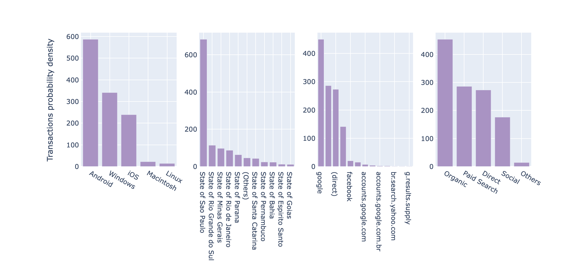
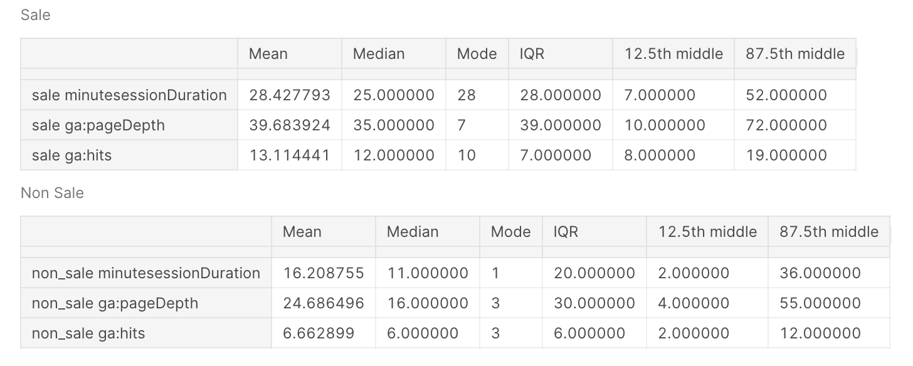
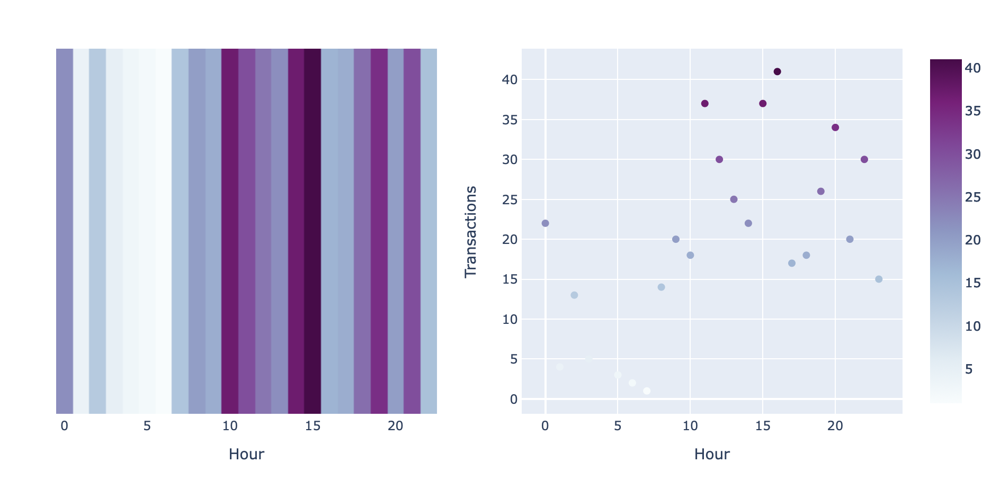
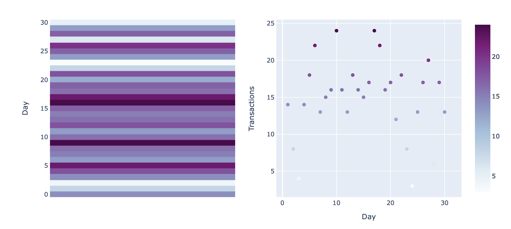
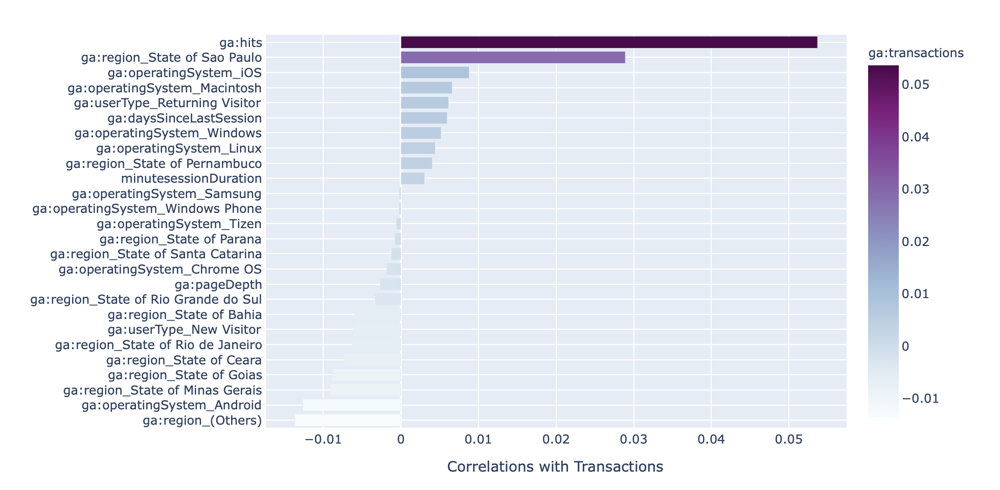

# Google Analytics API - Ecommerce - Exploratory Data Analysis - Project Overview

## Motivation
Having a good understanding of the behavior of the customers will make it easier to find ways to improve the experience online and reduce the difficulties to buy online. The longer visitors stay on your site, the more pages they visit, and the more actions they take, the more engaged they will be and more likely to buy from you.
This notebook is an Exploratory Analysis that the main idea was to try to get different insights into the traffic mediums of eCommerce.
Exploring the transactions, getting insights into the buyer's profile, buyer behavior, and checking the correlation between our features and transaction.
All information could be used for a better understanding of eCommerce, further strategies, and improvements on the user experience.

## Overview
* Was built an exploratory analysis to get different insights about each of the traffic mediums of eCommerce.
* The data was extracted using the **Google Analytics API**.
* Splitting the data set into traffic mediums and running the functions through each data set to explore the transactions, get insights of the buyers profile, buyer behavior, and checking the correlation between our features and transaction, we are going to have a good understanding of them.
* Using descriptive statistics we are going to present inferences about each traffic medium
* In the end we will present a clear conclusion section that presents the main differences & patterns of each traffic medium and find a hypothesis to be tested in further projects to improve the user experience in eCommerce. 

## Resources Used
**Python Version**: 3.7 
**Packages**: pandas, plotly, display_html
 

## Data Cleaning
After exporting the data from the API and import in the notebook, I needed to clean up a few things. I made the following changes and created the following features:
* I Split 'ga:dateHour' in 'ga:day' and 'ga:hour'.
* Transformed Session Duration Bucket into Minutes.
* I Split Source/Medium to feature Source and Medium column.
* Made a list of sources per medium and defined it as a Medium column.
* Dropped unnecessary columns.
* Parsed the distribution.

## Defining The Exploratory Functions 
I built 7 functions that will present the data in easy ways to interpret. The function is the following:

* **Sales Central Tendency** -  Will create a table with mean, median, mode and total of Item Quantity, Transactions and Transaction Revenue. Return example:

 

* **Conversion Rate** - Will count all sessions of the dataframe, calculate the percentile of session without transaction and with transactions. Return example:

 

* **Customer Profile**  -  Will plot a good visualisation of the customer's profile. Answering what are the top 5 operating systems they use, What are the top 10 regions of the users and In DFs with more than one source or medium we also will plot them. Return example:

 

* **Distribution of Buyers & Non Buyers Behavior** - Will compares the behavior metrics' minutesessionDuration',' ga: pageDepth ' and 'ga: hits' of the sessions with sale and the sessions without sales. Return example:

 

***Table** - In order to facilitate the interpretation we will create a table with the behavior of sessions with sale and without sales. Return example:

 

* **Sales Hour** - Will return two plots, the first one will be a Heat Map that shows what hour we got the higher number of transactions. The second one is a regression plot that will help us to visualize the linear relationships between the number of transactions and the hour of the day. Return example:

 

* **Sales Day** - Here we will do the same thing as above, however, the first plot will be a Heat Map that shows what day we got the higher number of transactions. The second one is a regression plot that will help us to visualize the linear relationships between the number of transactions and the day of the month. Return example:

 

* **Transaction Correlation** - That function will plot a vertical bar plot which is a nice way to visualise the Pearson Correlation Coefficient (PCC). Return example:

 

## Conclusions

### Differences & Patterns
After the analysis of the full data frame and the analysis per traffic medium, I was able to recognize some patterns and differences between the Full Df and the splitted data frame.

### Patterns

* **The central tendency** - The buyers of all traffic mediums used to do 1 transaction per purchase.

* **Conversion Rate** - All data frames are very unbalanced. Where transactions are the minority class.

* **Buyer Profile** - The buyer's majority are from São Paulo. The difference is the percentile per medium. All the traffic Medium has a very high percentile of Android users. Also, we can say that the buyers used to use mobile devices in most of the mediums.

* **Transaction Hour** - The higher number of transactions of all mediums happens in the afternoon and at night. Between 12h and 22h. Which makes the number of transactions have a strong positive correlation with the hour in all Mediums.

* **Transaction Correlations** - Hits, Minutes Session Duration, be from São Paulo, Macintosh users or Return Visitors always are positively correlated with the transaction. Also, IOS Windows are almost always positively correlated with transactions. The exception is Social Medium. On the other side New visitor, Other regions, and Android users are always negatively correlated with the transaction.
### Differences

* **The Central Tendency** - In the average of the Full Df the buyers used to buy 6 items per transaction but per medium that has a small variance. Organic has a smaller number of items per sale and Direct the higher one 7.64. About revenue, Paid Search has the higher ticket 108.82 and Organic the smaller, 86.30.
Conversion Rate - The Organic medium brings the most of the users (186,314). Followed by Paid Search (169,042), Direct (93,036), and Social 114,971. About the conversion rate, Direct has the higher one with 0.29%, followed by Organic 0.24%, Paid Search 0.17%, and Social 0.15%.

* **Buyer Profile** - The most common Operating System is Android in the majority of the Medium. In the Direct medium, it changes for a small difference to IOS.

* **Distribution of Buyer and non Buyers Behavior** - Here we can see that all Mediums behave differently on the website. To have an overview and highlight these differences we can look at the mode of buyers per medium. The Minute Session Duration of the Buyers for example, the lower is 10 minutes (Direct) and the higher is 39 minutes (Paid Search). The modes of the Page Depth are very different in each medium. 7 is the mode number of pages depth for Organic and 55 of Paid Search. For Hits the difference is also notable, sessions of buyers from Direct medium often do 8 Hits on the site, and users from Paid Search used to do 17 hits. Another important difference could be noted in the tables in each Traffic Medium session of the netbook but these numbers can prove the point each source medium behaves differently on the website.

* **Transactions Day** - The Organic medium seems to have more transactions in the first half of the month, while the rest of the medium seems to have more transactions in the second half.

* **Transaction Correlations** - As much as we have found some patterns in the transaction correlations, the value of the PCC always varies considerably across the mediums.

## Hypotese Test
We had a good understanding of the behavior of the customers of each traffic medium and found a hypothesis that can improve the online experience of the customers. 
The New Visitors using Android are facing problems.
It could be proved by observing the negative correlation in all mediums.

Saw that 64% of the users who spend less than 1 minute on the website use Android and are New Visitor. Two possible reasons for that are page loading speed and the mobile usability of the site. That can be checked with other metrics in Google Analytics.

Improving the experience for that type of user is important because it is very likely that it can increment revenue. Once the majority of these users (33%) use Android and are from São Paulo. The same buyer profile pattern was identified in our Exploratory analysis.

Another approach that can be suggested to improve the sales are strategies to increase the number of return visitors to the website. Once the Return Visitors are always positively correlated with the transaction.
 

Author: Erick C. Varela 
Date: 2/10/2020

 
 
 

##  For a better visualization:

### [See The Kernel On Kaggle](https://www.kaggle.com/erickvarela/ga-api-ecommerce-exploratory-analysis)

### [Or On Nbviewer](https://nbviewer.jupyter.org/github/varelaerick/Google-Analyts-API-Ecommerce-Exploratory-Data-Analysis/blob/main/ga-api-ecommerce-exploratory-analysis.ipynb)

